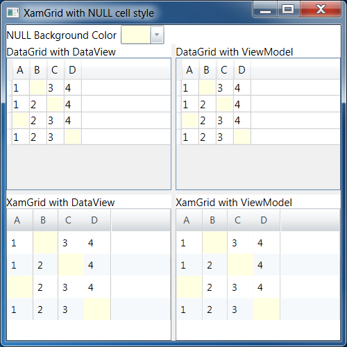

# XamGrid with Styled Background for Null values

This is a test project to create an Infragistics XamGrid that uses a custom style to
change the background color for the cell if the binding value is null. This is similar
to Sql Server Management Studio (SSMS) that uses a special background color for NULL values.
I don't want the cell style to also put `NULL` in the TextBlock, but it would be nice 
to know how to do it as well.

The main issue was how to get the cell value from the column binding. The solution was
set the DataTrigger binding to `RelativeSource={RelativeSource Self}` with
`Path=Cell.Value` in combination with the `IsNullConverter`. Before I found the solution
using the RelativeSource, I had to hard-code the Binding to a property on the row DataContext.

I created two XamGrids where one is bound to a `DataView` (from a `DataTable`) and the
other is bound to a `ViewModel`.

I also added two DataGrids for comparison, although technically it isn't fully working
either. The style for the DataGrids is bound to the `TextBlock.Text` value and applies
the style when `Text` is empty instead of only when the value is null.



Sample screenshot of SQL Server Management Studio with cell background:


## Issues

1. **RESOLVED** The `NullCellStyle` has a hard-coded binding in the `DataTrigger`. How can I create
a style that uses the binding of the column instead?


    ```xml
        <!-- Instead of using a hard-coded binding, such as -->
        <DataTrigger Binding="{Binding A, Converter={StaticResource IsNullConverter}}" Value="True">
        <!-- reference the binding value through `CellControl.Cell.Value` -->
        <DataTrigger Binding="{Binding Cell.Value, RelativeSource={RelativeSource Self}, Converter={StaticResource IsNullConverter}}" Value="True">
    ```

2. How can I change the text in a `<ig:TextColumn>` if the binding value is null?

3. The `EmptyTextBlock` style (with DataGrid) actually compares against empty Text instead of null binding value.

